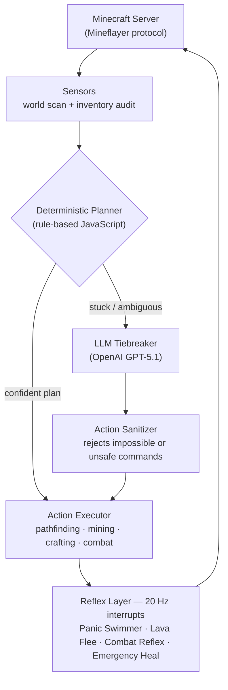

# Apex_AI: Autonomous Minecraft Agent

Hey, I'm Michael. Welcome to the Apex_AI project.

This is an autonomous, LLM-powered agent that plays Minecraft completely on its own. Unlike traditional gaming macros that just follow a pre-programmed list of coordinates, Apex_AI uses a reasoning model to dynamically explore a randomized 3D world, gather resources, manage its own inventory, and upgrade its tech tree from punching trees to mining deep-underground Diamonds — all the way to fighting the Ender Dragon.

I built this project to explore systems engineering and autonomous robotics logic. In an unpredictable environment like Minecraft, the hardest challenge isn't making an AI "smart"—it's building the safety systems to keep it from doing something fatal.

## How It Works: The Brain vs. The Body

This bot operates on a dual-layer architecture:

**The Brain (OpenAI / Prompting):** The LLM acts as the high-level decision-maker. It looks at the bot's current Y-level, inventory, and visible surroundings, and decides on the next best macro-action (e.g., "I need iron armor, I have a stone pickaxe, I should tunnel to Y=16").

**The Body (Node.js / Mineflayer):** The JavaScript handles the physical execution (pathfinding, mining, placing blocks). More importantly, the JavaScript acts as the System Supervisor. It constantly monitors the AI for hallucinations, logical loops, or unsafe behavior, and intercepts bad commands before they execute.

The key design decision: **the LLM is a consultant, not a pilot.** A deterministic planner handles the moment-to-moment decisions for free and at zero latency. The LLM is only consulted when the planner is genuinely stuck — and even then, its answer passes through a sanitizer that checks it against the bot's real inventory before a single block gets mined.

## Key Engineering Features (The Guardrails)

The true complexity of this bot lies in the JavaScript safety overrides I had to build to keep the AI alive:

**The "Lunchbox" Rule (Prerequisite Enforcement):** If the AI attempts to tunnel deep underground, the supervisor checks its inventory. If the bot doesn't have a minimum amount of wood, a crafting table, and a furnace, the code physically blocks the AI from entering the mine and forces it to gather surface supplies first.

**The "Panic Swimmer" (Hardware Interrupt):** Pathfinding algorithms are notoriously bad at swimming. I built a background loop that runs 20 times a second. If the bot's head registers as being inside a water block, the JS hijacks the controller from the AI and forces the bot to swim to the surface to prevent drowning.

**The Ingredient Cascade:** If the AI tries to craft a Wooden Pickaxe but forgets to craft planks and sticks first, the JS catches the impossible request and automatically works backward down the tech tree, crafting the missing prerequisites silently.

**The Greed Cut-Off:** LLMs suffer from "goal fixation" and will continuously mine iron until their pickaxe breaks. Once the bot hits exactly 24 iron, the JS overrides the AI's mining commands and forces it to place a furnace and start smelting.

**The "Oven Watcher":** The bot continuously monitors the state of a burning furnace. If it runs out of fuel mid-smelt, it aborts the wait loop, physically rips the unsmelted ore out of the oven to save it, and retreats to the surface for more wood.

**Mid-Flight Replanning:** Long actions (like tunneling 60 blocks down) don't lock the bot into a stale decision. A watcher re-runs the planner every 2 seconds during execution, and if the world has changed enough that a better high-confidence plan exists, it aborts the current pathfinding goal mid-flight and pivots.

👉 **Want to see the real code?** Check out [Inside the Code](docs/inside-the-code.md) — annotated excerpts of the guardrails above, straight from the codebase.

## Bonus: The Streamer Persona

The bot doubles as an entertainer. A second, cheaper model (`gpt-4o-mini`) runs a live commentary layer with a configurable persona — a cocky AI speedrunner that hypes its wins, tilts at deaths, and trash-talks mobs. Decision-making and personality run on separate models so the expensive reasoning model is never wasted on banter, and the commentary layer can be switched to zero-cost templated lines with one config flag.

## Tech Stack

| Layer | Technology |
|---|---|
| Language | JavaScript (Node.js) — 12,000+ lines |
| Game interface | [Mineflayer](https://github.com/PrismarineJS/mineflayer) + mineflayer-pathfinder (3D movement geometry), mineflayer-pvp, mineflayer-collectblock |
| Strategic reasoning | OpenAI API — GPT-5.1 with `reasoning_effort: "minimal"` for fast, bounded decisions |
| Live commentary | OpenAI API — gpt-4o-mini (cost-optimized persona layer) |
| World memory | Custom persistent JSON world model (remembers portals, bases, points of interest across sessions) |
| Live view | prismarine-viewer (browser-based first-person view of the bot) |

## Future Scope

Currently, the bot is highly capable at the "Item Collection" and "Survival" phases of the game. The next step in this project's evolution is tackling "Long Horizon Tasks," specifically teaching the bot spatial awareness around lava pools to survive the Nether and navigate Strongholds.

## Source Code

The full source for this project lives in a private repository. This public page exists to document the architecture and engineering approach — if you'd like to see the code or discuss the project, feel free to reach out.
